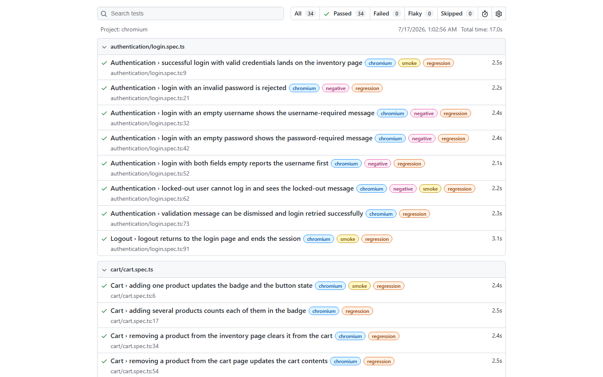
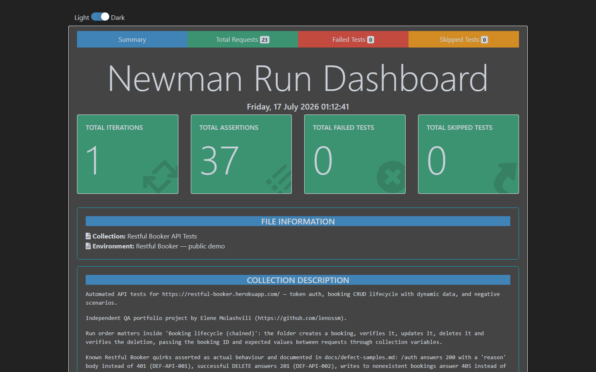

# QA Automation Portfolio — Elene Molashvili

Junior QA Engineer focused on manual testing, API validation, and reliable test automation.

Computer Science student building practical QA skills through hands-on projects. This portfolio contains two complete, independently runnable test automation projects — each with real executed test runs, professional test documentation, defect reports, and CI configuration. Both are independent portfolio projects against public demo applications; neither represents commercial work.

- GitHub: [github.com/lenossm](https://github.com/lenossm)
- LinkedIn: [linkedin.com/in/elene-molashvili-54952b2b9](https://www.linkedin.com/in/elene-molashvili-54952b2b9)

---

## Project 1 — [Playwright UI Automation Framework](ui-automation-framework/)

End-to-end UI test framework for [SauceDemo](https://www.saucedemo.com/), a demo e-commerce store.

**34 automated tests** covering authentication, product catalogue, sorting, cart, checkout (including totals arithmetic) and a full purchase journey — plus a test plan, 34 documented test cases, a regression checklist, a risk analysis and a summary report from real runs.

| | |
| --- | --- |
| Stack | Playwright, TypeScript (strict), Page Object Model, fixtures, Allure, ESLint, Prettier, dotenv, GitHub Actions |
| Latest run | 34/34 passed (25.8 s), smoke 8/8 (6.8 s) — 2026-07-17, local |
| Docs | [Test plan](ui-automation-framework/docs/test-plan.md) · [Test cases](ui-automation-framework/docs/test-cases.md) · [Summary report](ui-automation-framework/docs/test-summary-report.md) |



## Project 2 — [REST API Testing Portfolio](api-testing-portfolio/)

API testing for [Restful Booker](https://restful-booker.herokuapp.com/), a public hotel-booking training API, implemented in **two complementary tool chains**: Playwright `APIRequestContext` (TypeScript, Ajv schema validation) and a Postman collection run by Newman.

**29 Playwright tests + 37 Newman assertions** covering token auth, the full booking CRUD lifecycle with dynamically generated data, contract validation and systematic negative testing — plus six honestly reproduced defect reports on the API's real deviations from REST conventions.

| | |
| --- | --- |
| Stack | Playwright APIRequestContext, TypeScript, Ajv, Postman, Newman, newman-reporter-htmlextra, dotenv, GitHub Actions |
| Latest run | Playwright 29/29 passed (6.9 s); Newman 37/37 assertions (6.2 s) — 2026-07-17, local |
| Docs | [API test plan](api-testing-portfolio/docs/api-test-plan.md) · [Endpoint matrix](api-testing-portfolio/docs/endpoint-matrix.md) · [Defect reports](api-testing-portfolio/docs/defect-samples.md) |



---

## Skills demonstrated

- **Test design**: positive/negative scenario design, boundary thinking, prioritised test cases with preconditions and expected results (64 documented cases across both projects)
- **UI automation**: Page Object Model, component reuse, stable `data-test`/role selectors, web-first assertions, no fixed sleeps, tagged smoke/regression suites
- **API testing**: CRUD lifecycles with generated data and cleanup, JSON schema validation, header/status/type/timing assertions, chained Postman requests with pre-request scripts
- **Defect reporting**: reproduced defects written up with environment, steps, expected vs actual, severity/priority and re-runnable automated evidence
- **Reporting**: Playwright HTML, Allure results, Newman htmlextra — all generated from real runs
- **CI**: GitHub Actions pipelines with quality gates (lint, format, typecheck) ahead of test execution and artifact uploads
- **Engineering hygiene**: TypeScript strict mode, type-aware ESLint, Prettier, environment-based configuration, no secrets in the repository

## How to run

Each project is self-contained. In `ui-automation-framework/`:

```bash
npm install && npx playwright install chromium
npm run test          # full suite   |  npm run test:smoke  |  npm run test:report
```

In `api-testing-portfolio/`:

```bash
npm install
npm run test          # Playwright API suite
npm run postman:test  # Postman collection via Newman
```

Both read configuration from a `.env` file (`.env.example` provided; the default values are the applications' published demo credentials, so everything runs out of the box).

## Repository layout

```
qa-automation-portfolio/
├── ui-automation-framework/   UI project (self-contained, own CI workflow)
├── api-testing-portfolio/     API project (self-contained, own CI workflow)
├── portfolio-assets/          Screenshots from real runs, diagrams
├── IMPLEMENTATION_PLAN.md     How this portfolio was planned and built
├── PROGRESS.md                Phase-by-phase build log
├── FINAL_QUALITY_REPORT.md    Commands executed, results, limitations
└── PORTFOLIO_REVIEW.md        Guided tour for reviewers
```

Each project folder is designed to be moved into its own GitHub repository as-is (suggested names: `saucedemo-playwright-framework` and `restful-booker-api-testing`).

## Contact

**Elene Molashvili** — [GitHub](https://github.com/lenossm) · [LinkedIn](https://www.linkedin.com/in/elene-molashvili-54952b2b9)
