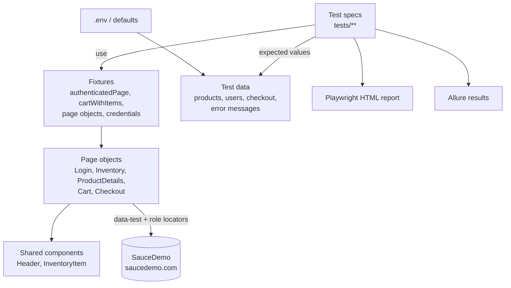
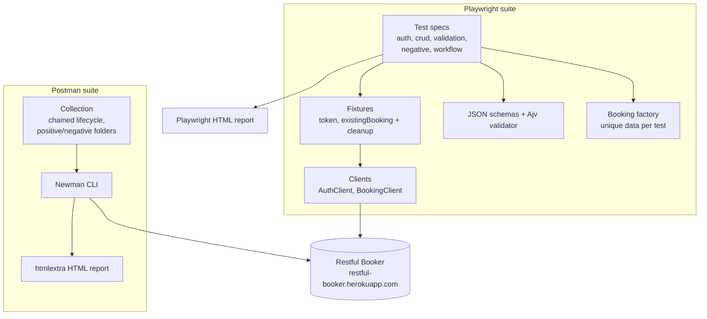
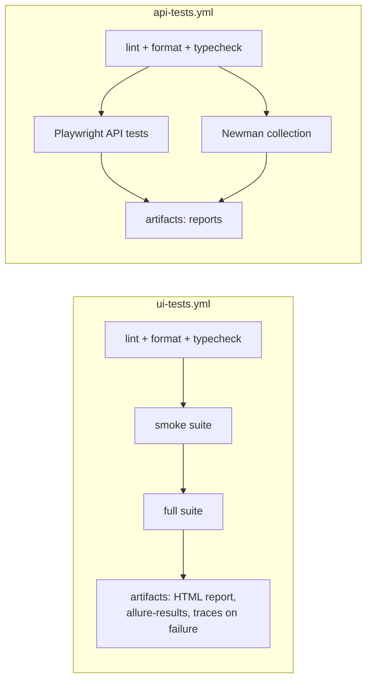

# Architecture Diagrams

Mermaid sources — GitHub renders these directly.

## UI framework — test execution flow

```mermaid
flowchart TD
    T[Test specs<br/>tests/**] -->|use| F[Fixtures<br/>authenticatedPage, cartWithItems,<br/>page objects, credentials]
    F --> P[Page objects<br/>Login, Inventory, ProductDetails,<br/>Cart, Checkout]
    P --> C[Shared components<br/>Header, InventoryItem]
    T -->|expected values| D[Test data<br/>products, users, checkout,<br/>error messages]
    P -->|data-test + role locators| APP[(SauceDemo<br/>saucedemo.com)]
    T --> R1[Playwright HTML report]
    T --> R2[Allure results]
    ENV[.env / defaults] --> D
```

## API project — two complementary tool chains

```mermaid
flowchart TD
    subgraph Playwright suite
        S[Test specs<br/>auth, crud, validation,<br/>negative, workflow] --> FX[Fixtures<br/>token, existingBooking + cleanup]
        FX --> CL[Clients<br/>AuthClient, BookingClient]
        S --> SC[JSON schemas + Ajv validator]
        S --> FA[Booking factory<br/>unique data per test]
    end
    subgraph Postman suite
        PC[Collection<br/>chained lifecycle,<br/>positive/negative folders] --> NM[Newman CLI]
        NM --> HR[htmlextra HTML report]
    end
    CL --> API[(Restful Booker<br/>restful-booker.herokuapp.com)]
    NM --> API
    S --> PR[Playwright HTML report]
```

## CI pipelines

```mermaid
flowchart LR
    subgraph ui-tests.yml
        A[lint + format + typecheck] --> B[smoke suite] --> C[full suite]
        C --> D[artifacts: HTML report,<br/>allure-results, traces on failure]
    end
    subgraph api-tests.yml
        E[lint + format + typecheck] --> G[Playwright API tests]
        E --> H[Newman collection]
        G --> I[artifacts: reports]
        H --> I
    end
```
